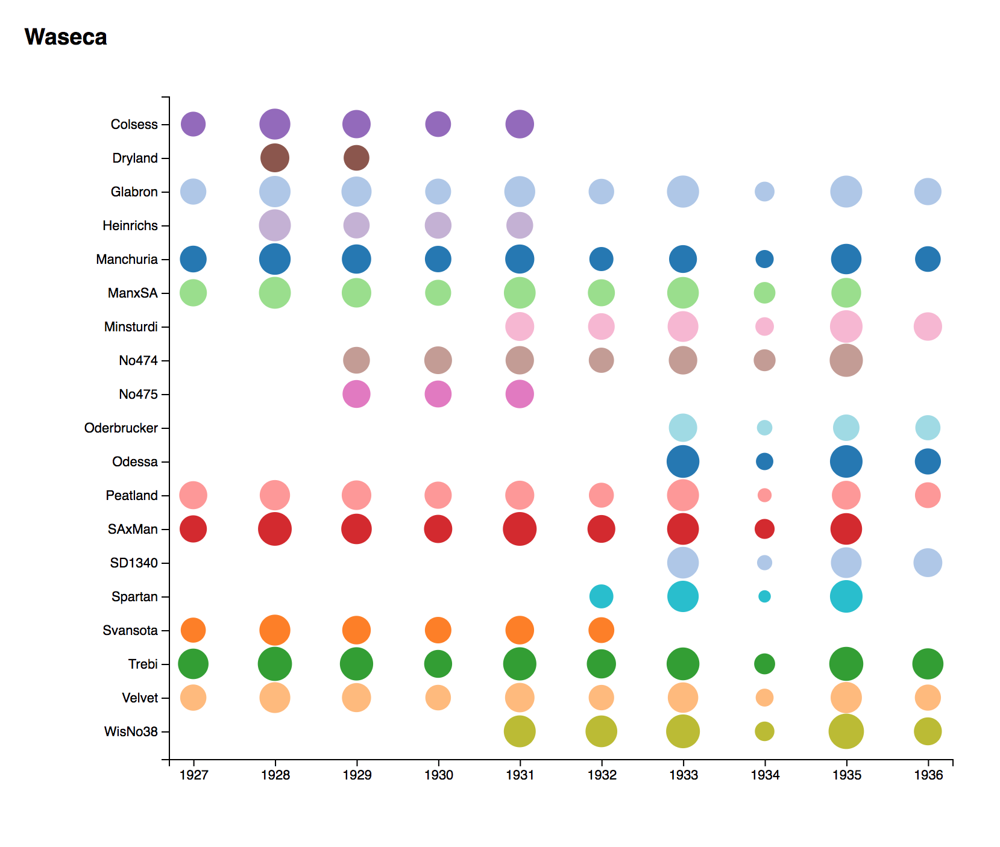
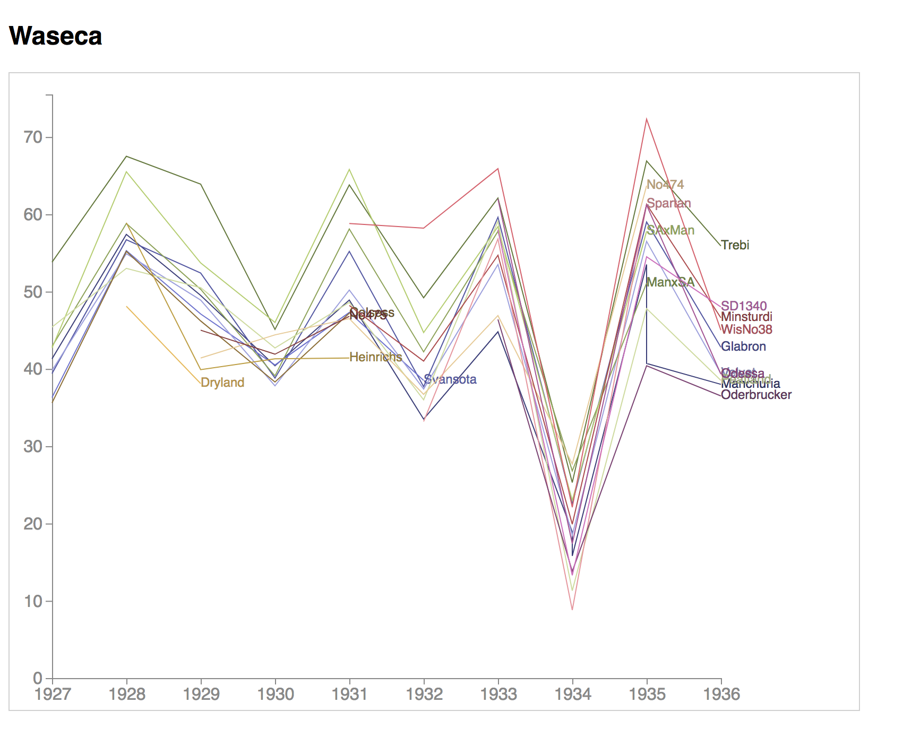

# 05-general-update-pattern
We'll make a "punchcard" chart from barley yield data that is updatable to demonstrate D3's [General Update Pattern](https://github.com/d3/d3-selection#joining-data).

Punchcard charts use the area of circular marks to encode value. These marks are positioned using fixed x and y coordinates. Setting the color for each data point to its variety type helps makes the varieties easier to compare.

Notice that in the punchcard chart above how it's much easier to decipher the change in time across multiple varieties of barley then the following line chart:

The line chart makes it hard to compare individual varieties of barley due to the many overlapping lines. However, it may be more useful for showing trends over time. In both charts the dip in 1934 is evident, but the line chart does a better job of showing how drastic this dip was.

## Resources
The following 3 examples break down d3's General Update Pattern and are useful to refer to.
- [The General Update Pattern, I](https://bl.ocks.org/mbostock/3808218)
- [The General Update Pattern, II](https://bl.ocks.org/mbostock/3808221)
- [The General Update Pattern, III](https://bl.ocks.org/mbostock/3808234)

### D3 Modules Used
- [d3-selection](https://github.com/d3/d3-selection)
- [d3-transition](https://github.com/d3/d3-transition)
- [d3-collection](https://github.com/d3/d3-collection)
- [d3-scale](https://github.com/d3/d3-scale)
- [d3-array](https://github.com/d3/d3-array)
- [d3-timer](https://github.com/d3/d3-timer)

### Vanilla JS
The reduce function is a super useful method to have in your data manipulation arsenal, so make sure to take the time to master it. We'll also go over it in class.
- [Array.prototype.reduce()](https://developer.mozilla.org/en-US/docs/Web/JavaScript/Reference/Global_Objects/Array/Reduce?v=b)
